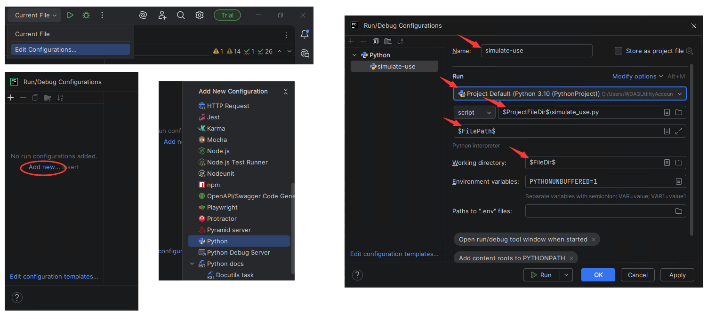

# opentrons-simulate-use

This is an **unofficial** repo with no affiliation to Opentrons

## Motivation

The current `opentrons_simulate` comes with limitation that it is [impossible to specify and use non-default runtime parameters](https://github.com/Opentrons/opentrons/issues/15678), and therefore cannot run a protocol that uses csv file parameter, which has no default.

The goal of this script is to provide an alternative entrypoint of `opentrons_simulate` that overcomes this limitation.

## Feedback

If you noticed an error or the script does not work as expected, [open an issue](https://github.com/ywei1081/opentrons-simulate-use/issues/new/choose) to tell what you encountered.

## Usage

To use this script, [Download](https://github.com/ywei1081/opentrons-simulate-use/archive/refs/heads/main.zip) and save `simulate_use.py` into your project folder. Make sure [`opentrons` Python package](https://docs.opentrons.com/v1/writing.html#non-jupyter-installation) is installed, then simply replace `opentrons_simulate` with `python simulate_use.py` in your command.

To specify the parameter to use, add a comment right above where you call `add_xxx()` method inside `add_parameters()` function:

```Python
def add_parameters(parameters):
    ...
    # simulate-use: labware-b
    parameters.add_str(
        display_name="Labware",
        variable_name="labware",
        default='labware-a'
    ...

    # simulate-use: test.csv
    parameters.add_csv_file(
    ...
```

Or add a harmless assignment line:

```Python
    _simulate_use = 'labware-b'
    parameters.add_str(
        display_name="Labware",
        variable_name="labware",
        default='labware-a'
    ...
```

No more changing default values back and forth, nor any side effect to be carried into production.

## Use in an IDE environment (PyCharm example)

To use the script inside an IDE environment like PyCharm, simply add a run configuration using this script as entrypoint.

- From top panel, select "Edit Configurations..." from dropdown
- Click "Add new..." and find "Python" in the list of choices
- Fill in configuration details
    - Fill in a preferred name
    - Select correct version of Python interpreter
    - Keep "script" option as is
    - In the text box next to "script", fill in where you put the script. You can click the folder icon to navigate to the script. Optionally using [macros](https://www.jetbrains.com/help/pycharm/code-running-assistance-tutorial.html#run) to simplify path
    - In "Script parameters", write `$FilePath$`. This macro allows passing current protocol file to be simulated as argument, rather than runnning the protocol as plain Python script inside Python interpreter
    - In "Working directory", write `$FileDir`
- Finally, click "OK" and save the configuration.
- Click line number to add breakpoints and etc., click Debug button, and enjoy full development experience inside your preferred IDE


